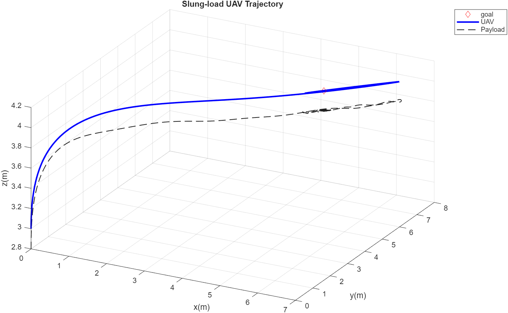

# Dynamic Inversion Control for Quadrotor with Slung Load

This project provides a Simulink-based simulation of a quadrotor (UAV) carrying a slung load, implementing a **dynamic inversion controller**. The goal is to carry the load to a desired position, with oscillation attenuation along the trajectory. The simulation includes a detailed vehicle model, controller blocks, and simulation scripts for initialization, execution, and result visualization.

---

## Project Structure
├── dynamicInversionControl.slx # Simulink model: quadrotor + controller <br>
├── initialParameters.m # Simulation parameters and initial conditions loader <br>
├── run_main.m # Main script to run simulation and plot results <br>
├── util/ <br>
│ ├── DatasetToStruct.m <br>
│ ├── JsonDump.m <br>
│ └── JsonLoad.m <br>
├── userDefined/ <br>
│ ├── initialConditions.json <br>
│ └── params.json <br>
├── results/ <br>
│ └── test_controller.json # Simulation output (generated) <br>
└── generated fcns/ # This folder isn't used elsewhere --- simply contains some manual derivations.


## Getting Started

### Prerequisites

- **MATLAB** 
- **Simulink** (R2025a required to open)

---

## Usage

### 1. Configure Parameters

- **Edit initial conditions:**  
  Modify `userDefined/initialConditions.json` to set the initial UAV and payload state.
- **Edit system and controller parameters:**  
  Modify `userDefined/params.json` for vehicle properties, mission path, and controller gains.

### 2. Run Simulation

From MATLAB command window:

```matlab
run('run_main.m');            % Runs the simulation and plots results

Example result:
